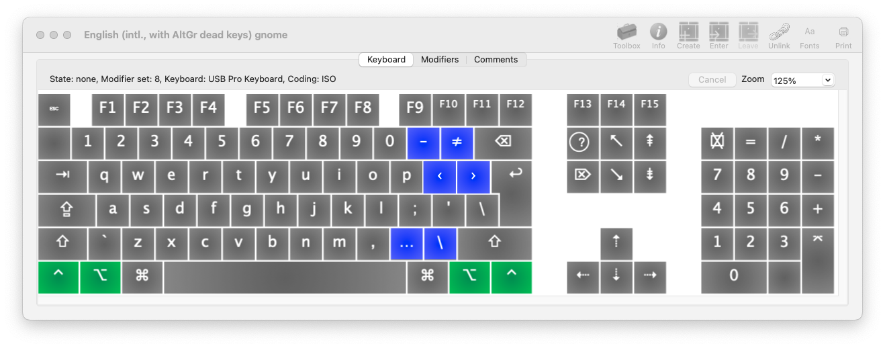

# English (intl., with AltGr dead keys)
This is a `.keylayout` file for MacOS which implements the "English (intl., with AltGr dead keys)" layout existing in Linux.

#### Features

Same as  [bteixeira's *`keylayout-en-intl-altgr-dead-keys`*](https://github.com/bteixeira/keylayout-en-intl-altgr-dead-keys) with extra glyphs when `ctrl + option` are pressed:

`ctrl + option + . [dot]` => `… [ellipsis]`

`ctrl + option + - [minus]` => `– [ndash]`

`ctrl + option + = [equal]` => `≠ [not equal]`

`ctrl + option + / [forward slash]` => `\ [backward slash]`

`ctrl + option + [` => `‹ [left single guillemet]`

`ctrl + option + ]` => `› [right single guillemet]`

***

#### Rationale

* As a Dual Boot MacOS + Linux User with a blank keycaps keyboard (HHKB), I want the input method to be as consistent as possible.
* As an opinionated Typophile, I want easy access to a few more neat looking punctuation marks.
